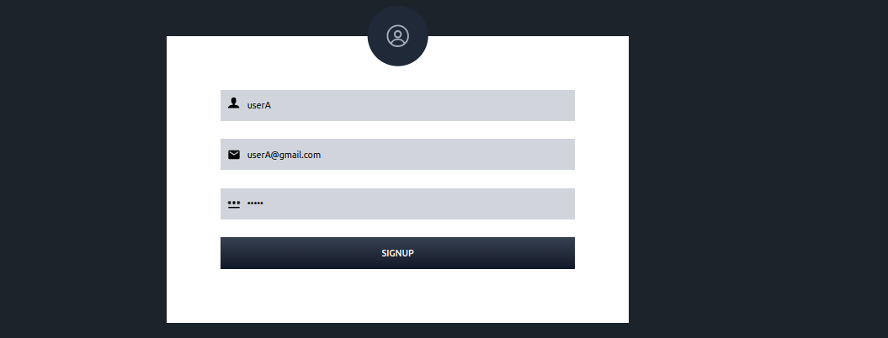
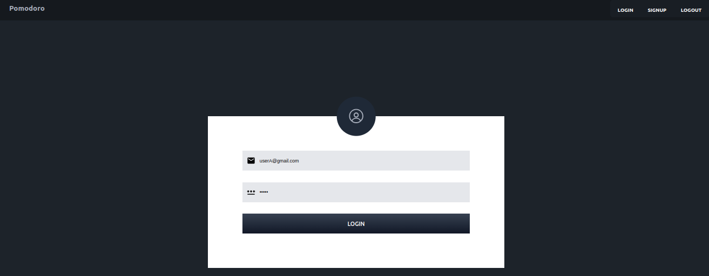
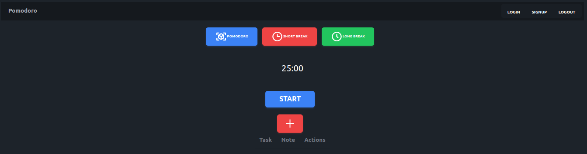
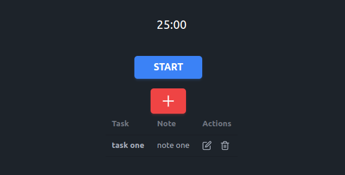
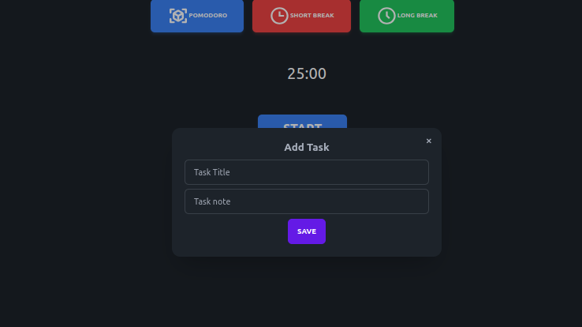
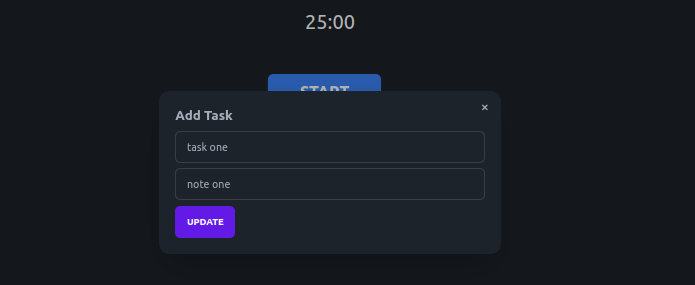

## Tech Stack
- NextJs
- TypeScript
- MongoDB
- jsonwebtoken, axios, react-icons, daisyUi, mongoose
## Project Description
Hello, I hope find this project helpful!
The idea behind this project is to create some functions that exist on a real-world project, also I try to be more familiar with nextjs.
To contact me [med.chaabi98@gmail.com](med.chaabi98@gmail.com). 

## Getting Started

First, run the development server:

```bash
npm run dev
# or
yarn dev
# or
pnpm dev
```

Open [http://localhost:3000](http://localhost:3000) with your browser to see the result.







